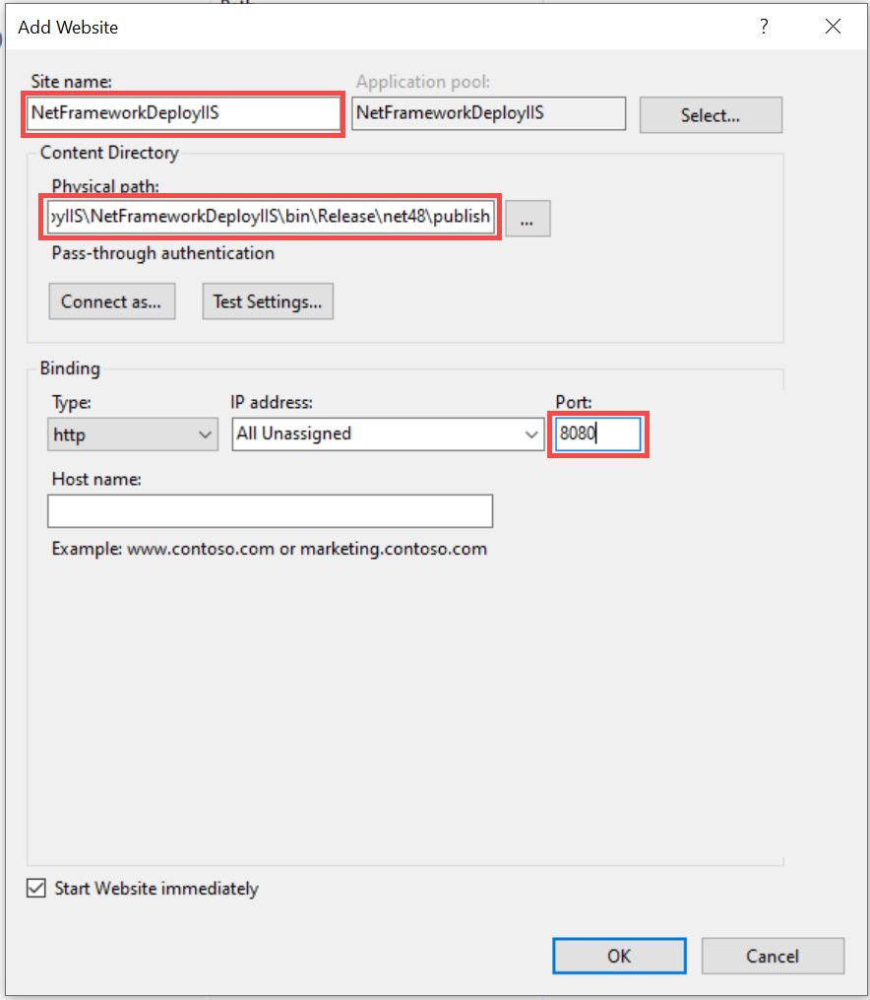

## NET Framework IIS Deploy

### Enable IIS on Windows

- Enable IIS using Control Panel
  
- Verify how IIS works on localhost
  

### Deployment process

- Create a new IIS website
  
- Publish project to the website physical path
- Validate the website
  

### Video how to deploy

- https://www.youtube.com/watch?v=PPaqVyBkwMk